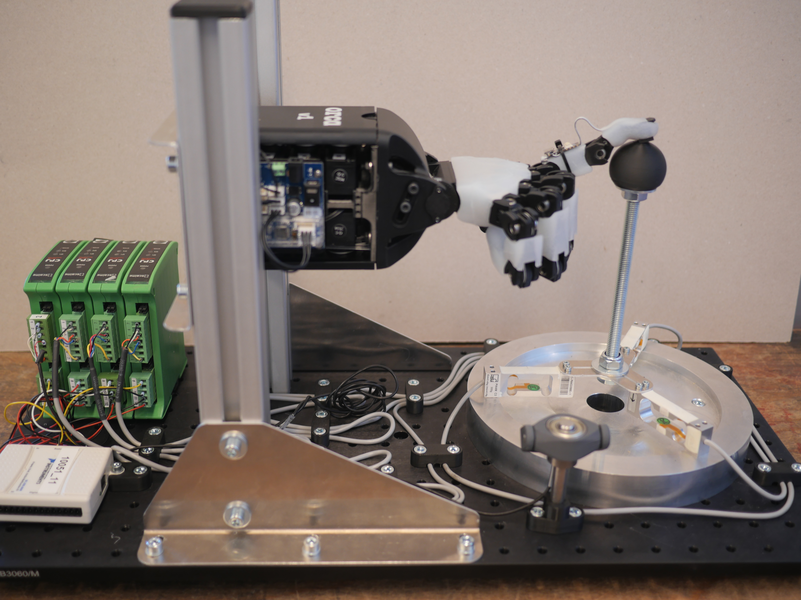
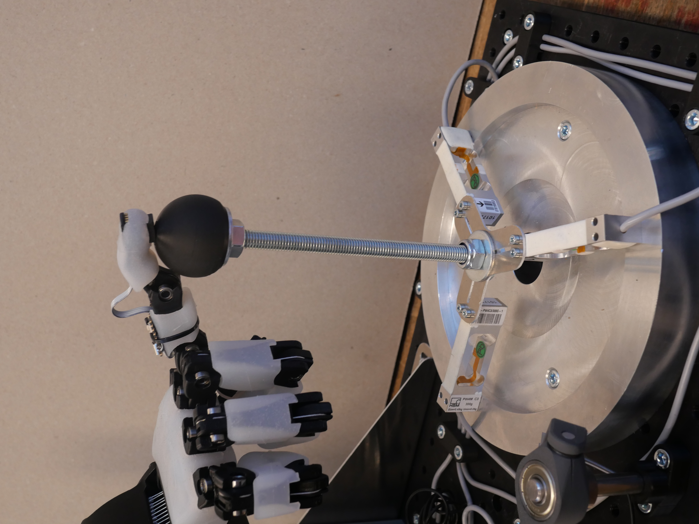

# Standardizing Tactile Sensing Across Diverse Material System

An open tactile hand system designed to bridge the gap between raw touch sensing and precise force understanding, with calibrated force measurement for accurate tactile-to-force mapping.

## Overview

This project develops a synchronized data collection pipeline that aligns tactile sensors and robotic control in time, reducing noise and inconsistencies that typically limit learning-based approaches. The finger-sensor fitting design and associated software are based on the [Orca hand](https://github.com/orcahand).

At its core is a calibrated force measurement setup that ensures reliable ground truth, enabling accurate mapping between tactile signals and applied forces.

### System Architecture



The calibrated system provides an independent reference measurement of the contact force vector for evaluating the tactile sensor embedded in the robotic fingertip. It enables separate assessment of the sensor response to normal loading and tangential shear loading during controlled contact interactions.

#### Mechanical Design

The system uses a joystick-style mechanism with:
- A spherical contact interface mounted on a central rigid shaft
- Three radially arranged load cells supporting the shaft
- Load cell outputs that capture normal and shear forces

**Force Measurement:**
- Normal forces produce largely symmetric response across load cells
- Shear forces create asymmetric load distribution
- Known geometry and angular arrangement allow force component reconstruction



## Calibration

Calibration involves applying reference forces with known magnitudes and directions at the spherical contact surface while recording the three load cell outputs. The process includes:

- Applying loads across expected operating range based on finger joint offsets
- Testing multiple combinations of normal and shear directions
- Generating a calibration matrix that maps measured signals to force components
- Conducting repeated loading and unloading trials to quantify:
  - Reconstruction error
  - Repeatability
  - Hysteresis and cross-axis coupling
  - Sensitivity to contact location

## Installation

```bash
pip install -r requirements.txt
```

## Usage

### Main Scripts

- `orca_hand.py` - Main hand control interface
- `orca_manual_control.py` - Manual control mode
- `orca_calibrate_hand.py` - Calibration procedures
- `orca_probing.py` - Probing experiments
- `orca_hand_pose.py` - Hand pose management

See individual script files for detailed usage instructions.

## Project Structure

```
├── sensors/              # Sensor implementations
├── threads/              # Threading utilities
├── calibration_data/     # Raw calibration data
├── calibration_results/  # Processed calibration results
├── models/               # Hand model configurations
├── Arduino/              # Arduino firmware
├── archive/              # Legacy code
└── probing_experiment/   # Probing experiment utilities
```

## Contributors

- Daniel Stiekema
- Georgy Filonenko
- Sid Kumar
- Stephanie Tan

**Affiliation:** TU Delft

## References

Based on the [Orca Hand](https://github.com/orcahand) project.


